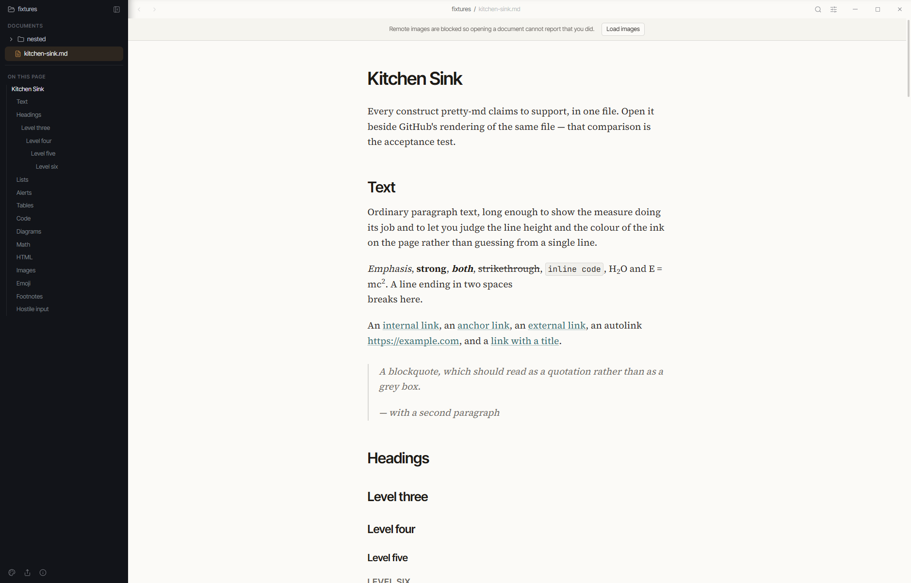
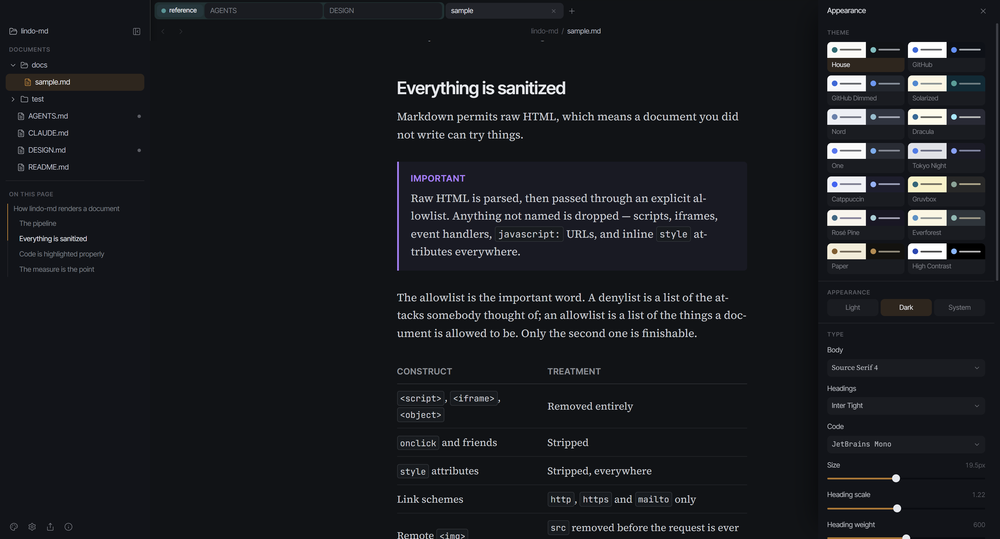

<div align="center">
  
  <h1>lindo-md</h1>
  <p><strong>A Markdown viewer that makes documents worth reading.</strong></p>
  <p>
    <a href="https://github.com/gabmichels/lindo-md/releases/latest"></a>
    <a href="https://github.com/gabmichels/lindo-md/releases"></a>
    <a href="https://github.com/gabmichels/lindo-md/actions/workflows/ci.yml"></a>
    <a href="LICENSE"></a>
    
  </p>
  <p>
    <a href="#download">Download</a> ·
    <a href="#features">Features</a> ·
    <a href="#themes">Themes</a> ·
    <a href="#build-from-source">Build from source</a> ·
    <a href="./AGENTS.md">Contributing</a>
  </p>
</div>

<div align="center">
  <picture>
    <source media="(prefers-color-scheme: dark)" srcset="docs/screenshot-dark.png" />
    <source media="(prefers-color-scheme: light)" srcset="docs/screenshot-light.png" />
    
  </picture>
</div>

Local `.md` files usually open in a plain-text editor or a previewer that looks like a 2014 admin
panel. lindo-md renders them the way a well-set page should look — editorial typography, real
measure, considered rhythm — with the full GitHub feature set behind it, and lets you edit the page
you are reading without switching into a source view first.

It is a small native desktop app (Rust + Tauri), not an Electron shell, and it works entirely
offline. Nothing you open leaves your machine.

## Download

Grab the installer for your platform from the
[latest release](https://github.com/gabmichels/lindo-md/releases/latest).

<table>
<tr>
<td width="50%" valign="top">

### Windows

`lindo-md_<version>_x64-setup.exe` (installer)
`lindo-md_<version>_x64_en-US.msi`

Associates `.md` files, so **Open with → lindo-md** works.

</td>
<td width="50%" valign="top">

### Linux

`lindo-md_<version>_amd64.AppImage`
`lindo-md_<version>_amd64.deb`
`lindo-md-<version>-1.x86_64.rpm`

For the AppImage: `chmod +x lindo-md_*.AppImage`

</td>
</tr>
</table>

> [!NOTE]
> These builds are **unsigned**, so Windows SmartScreen will show "Windows protected your PC" the
> first time — choose **More info → Run anyway**. Instead of a code-signing certificate, every
> release publishes SHA256 checksums and signed [build provenance](https://docs.github.com/actions/security-guides/using-artifact-attestations),
> which ties each binary to the exact commit and workflow run that produced it:
>
> ```sh
> gh attestation verify <file> --repo gabmichels/lindo-md
> ```

**macOS** has no published build. It compiles fine, but an unsigned bundle fails Gatekeeper with
"lindo-md is damaged and can't be opened" — which reads as a broken download rather than a security
prompt — and clearing that requires a paid Apple Developer Program membership. Building from source
sidesteps it entirely, since a binary you compiled locally was never quarantined.

## Features

<table>
<tr>
<td width="33%" valign="top">

### Everything GitHub renders

Alerts, footnotes, tables, task lists, math, and **Mermaid diagrams** — with real VS Code syntax
highlighting via Shiki.

</td>
<td width="33%" valign="top">

### Edit in place

Type directly into the rendered page. There is no mode to enter and no Save to remember — the
Markdown file is the source of truth.

</td>
<td width="33%" valign="top">

### Tabs and tab groups

Contiguous, colored, collapsible groups. Every tab keeps its own scroll position and history, and
the whole session is restored on launch.

</td>
</tr>
<tr>
<td valign="top">

### Fourteen themes, all editable

Every preset ships a light and a dark half. Type, layout and thirteen individual colors are
adjustable, and the result exports to JSON.

</td>
<td valign="top">

### Genuinely offline

Remote images are blocked by default, so opening a document cannot report that you did. Shiki,
KaTeX and Mermaid are bundled, not fetched.

</td>
<td valign="top">

### Built to be lived in

File tree, "On this page" outline, reading progress, find, zoom, live reload, HTML export and
print-to-PDF.

</td>
</tr>
</table>

## What it renders

Everything GitHub renders:

- Headings with anchors, emphasis, strikethrough, sub/superscript
- Tables with alignment, task lists, footnotes, description lists
- GitHub alerts — `> [!NOTE]`, `TIP`, `IMPORTANT`, `WARNING`, `CAUTION`
- Fenced code with real VS Code syntax highlighting, a copy button, and optional filename headers
  (` ```ts title="main.ts" `)
- **Mermaid diagrams** — flowcharts, sequence, class, state, ER, gantt, and the rest, click to zoom
- Math, inline `$…$` and display `$$…$$`
- Emoji shortcodes, autolinks, `<details>`, `<kbd>`, raw HTML — sanitized against an explicit
  allowlist
- YAML frontmatter, relative image paths, and relative links between documents

Heading anchors carry no `user-content-` prefix, so a `file.md#anchor` link works exactly as typed.

## Editing

The rendered document is editable as it stands — there is no edit mode, and no Save command.

Typing rewrites the Markdown and re-renders from it, so the file on disk stays the single source of
truth rather than something reconstructed from the DOM. Text in paragraphs, headings, list items and
table cells is editable; code fences, Mermaid blocks and math are inert, as are generated bits like
heading anchors and footnote backrefs. Task list checkboxes are clickable and write straight to the
file.

Right-click for formatting — bold, italic, code, strikethrough, headings, lists, quotes — all applied
as Markdown, not as styling. `Ctrl + E` opens the raw source over the same scroller when you want it.

Writes are guarded: if the file changed underneath you since it was loaded, the save is refused
rather than silently overwriting someone else's work. A file edited by another program reloads
automatically.

## Themes



The default is **House**, a reading theme designed for this app: warm bone paper, Source Serif 4 at
a 66-character measure, ink-teal links. Thirteen more presets cover the themes people already read
in — GitHub, GitHub Dimmed, Solarized, Nord, Dracula, One, Tokyo Night, Catppuccin, Gruvbox,
Rosé Pine, Everforest, plus **Paper** (sepia and lamplight, set in Garamond) and **High Contrast**
(Atkinson Hyperlegible at a short measure).

Each is a light/dark pair presented as a single choice; the appearance setting — light, dark, or
follow the system — picks the half.

Every one of them is a starting point, not a fixed choice. Body, heading and mono font, size, type
scale, line height, measure, paragraph spacing, letter spacing, heading weight, justification, and
thirteen individual colors can be adjusted. Touching any control forks the preset into a custom
theme rather than overwriting it, and the result exports to a `.lindo-md-theme.json` file you can
share.

## Keyboard

| | |
| --- | --- |
| `Ctrl / ⌘ + F` | Find in document |
| `Ctrl / ⌘ + E` | Toggle the Markdown source |
| `Ctrl / ⌘ + P` | Print, or save as PDF |
| `Ctrl / ⌘ + T` · `+ W` · `+ Shift + T` | New tab · close · reopen closed |
| `Ctrl / ⌘ + Tab` · `+ 1…9` | Cycle tabs · jump to tab |
| `Ctrl / ⌘ + Z` · `+ Shift + Z` | Undo · redo |
| `Ctrl / ⌘ + +` · `+ -` · `+ 0` | Zoom in · out · reset |
| `Ctrl / ⌘ + ,` · `+ Shift + ,` | Settings · appearance drawer |

## Build from source

```bash
pnpm install
pnpm tauri dev      # run
pnpm tauri build    # bundle
```

Node ≥ 22.13, pnpm 11, and a stable Rust toolchain. On Linux you also need
`libwebkit2gtk-4.1-dev`, `libappindicator3-dev`, `librsvg2-dev` and `patchelf`.

## Not yet

Signed macOS builds, GitHub's geoJSON/topoJSON/ASCII-STL blocks, plugins, and sync are out of scope
for now.

## Contributing

[AGENTS.md](./AGENTS.md) covers the architecture, commands and conventions; [DESIGN.md](./DESIGN.md)
covers the visual rules. Both are short, and both are worth reading before a first PR.

## License

MIT © Gabriel Michels
