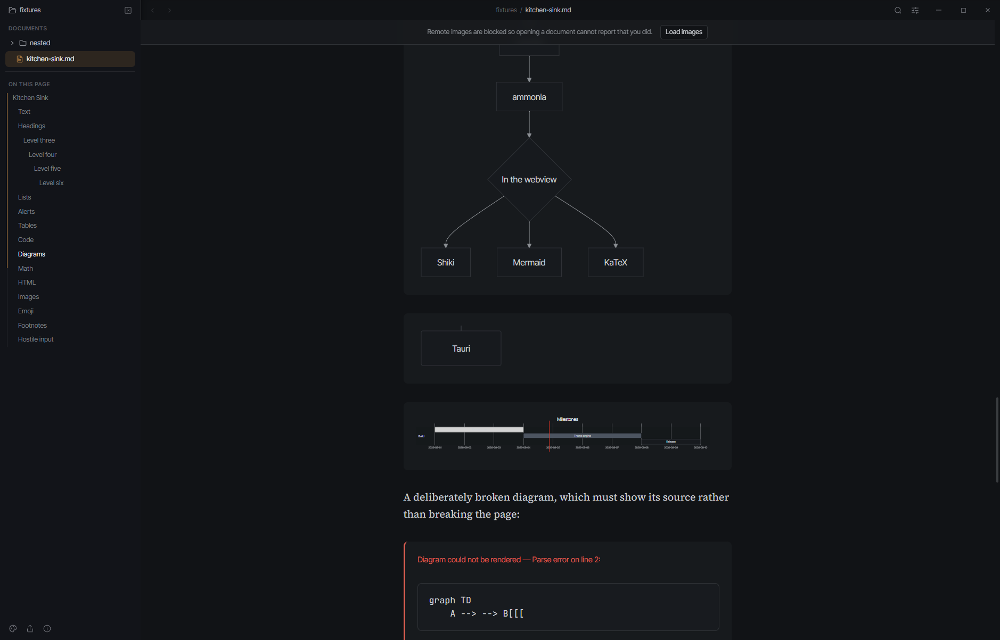

<div align="center">
  
  <h1>pretty-md</h1>
  <p><strong>A Markdown viewer that makes documents worth reading.</strong></p>
  <p>
    <a href="LICENSE"></a>
    
  </p>
</div>

Local `.md` files usually open in a plain-text editor or a previewer that looks like a 2014 admin
panel. pretty-md renders them the way a well-set page should look — editorial typography, real
measure, considered rhythm — with the full GitHub feature set behind it.

It is a small native desktop app (Rust + Tauri), not an Electron shell, and it works entirely
offline. Nothing you open leaves your machine.


## What it renders

Everything GitHub renders:

- Headings with anchors, emphasis, strikethrough, sub/superscript
- Tables with alignment, task lists, footnotes, description lists
- GitHub alerts — `> [!NOTE]`, `TIP`, `IMPORTANT`, `WARNING`, `CAUTION`
- Fenced code with real VS Code syntax highlighting, plus inline code
- **Mermaid diagrams** — flowcharts, sequence, class, state, ER, gantt, and the rest
- Math, inline `$…$` and display `$$…$$`
- Emoji shortcodes, autolinks, `<details>`, `<kbd>`, raw HTML — sanitized
- YAML frontmatter, relative image paths, and relative links between documents

## Themes



The default is **House**, a reading theme designed for this app: warm bone paper, Source Serif 4 at
a 66-character measure, ink-teal links. Presets cover the themes people already read in — GitHub
(light, dark, dimmed), Solarized, Nord, Dracula, One Dark Pro, Tokyo Night, Catppuccin, Gruvbox,
plus a sepia paper mode and a high-contrast mode.

Every one of them is a starting point, not a fixed choice. Font family, size, type scale, line
height, measure, paragraph spacing, letter spacing, heading weight, and every individual color can
be adjusted, and the result exports to a JSON file you can share.

## Install

Download the installer for your platform from [Releases](https://github.com/gabmichels/pretty-md/releases).

- **Windows** — `.msi` or `.exe`. Associates `.md` files, so "Open with → pretty-md" works.
- **Linux** — `.deb` or `.AppImage`.
- **macOS** — `.dmg`. The build is unsigned, so the first launch needs
  `xattr -cr /Applications/pretty-md.app`.

## Build from source

```bash
pnpm install
pnpm tauri dev      # run
pnpm tauri build    # bundle
```

Node ≥ 22, pnpm 10, and a stable Rust toolchain.

## Not yet

Editing, GitHub's geoJSON/topoJSON/ASCII-STL blocks, plugins, and sync are out of scope for now.

## Contributing

[AGENTS.md](./AGENTS.md) covers the architecture, commands and conventions; [DESIGN.md](./DESIGN.md)
covers the visual rules. Both are short, and both are worth reading before a first PR.

## License

MIT © Gabriel Michels
