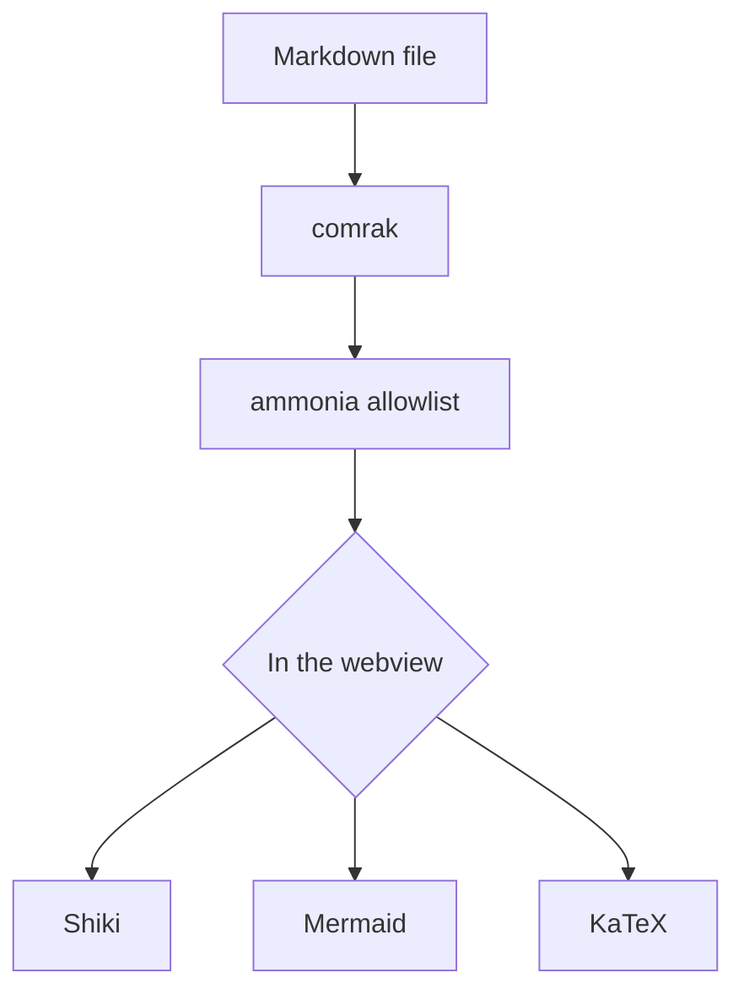

# How lindo-md renders a document

A Markdown viewer has one job that is easy to state and hard to finish: take a plain text file and
put it on screen the way its author meant it. Most of the difficulty is not in the parsing. It is in
deciding what the page should look like once the parsing is done, and in refusing to let a document
do anything it shouldn't.

## The pipeline

Rendering happens in two places on purpose. Structure is decided in Rust, before anything reaches
the screen; presentation is decided in the webview, where the fonts and the theme live.



The split matters. A parser that also styles its output tends to leak presentation into structure —
you end up with a class name that means "this is a heading" and another that means "this is a
heading, but blue". Keeping the two apart means the theme system has exactly one surface to change.

## Everything is sanitized

Markdown permits raw HTML, which means a document you did not write can try things.

> [!IMPORTANT]
> Raw HTML is parsed, then passed through an explicit allowlist. Anything not named is dropped —
> scripts, iframes, event handlers, `javascript:` URLs, and inline `style` attributes everywhere.

The allowlist is the important word. A denylist is a list of the attacks somebody thought of; an
allowlist is a list of the things a document is allowed to be. Only the second one is finishable.

| Construct | Treatment |
| --- | --- |
| `<script>`, `<iframe>`, `<object>` | Removed entirely |
| `onclick` and friends | Stripped |
| `style` attributes | Stripped, everywhere |
| Link schemes | `http`, `https` and `mailto` only |
| Remote `` | `src` removed before the request is ever made |

That last row is a privacy decision rather than a security one. An image hosted elsewhere is a
read receipt: fetching it tells the host that you opened the file, when, and from where. So the
fetch does not happen unless you ask for it.

## Code is highlighted properly

Not with a regex that knows about the word `function`, but with the same TextMate grammars VS Code
uses, loaded per language and only when a block scrolls into view.

```rust
pub fn sanitize(html: &str) -> String {
    ammonia::Builder::default()
        .tags(ALLOWED_TAGS.iter().copied().collect())
        .url_schemes(["http", "https", "mailto"].into_iter().collect())
        .clean(html)
        .to_string()
}
```

Math is set with KaTeX, inline as $e^{i\pi} + 1 = 0$ and in display form:

$$
\int_{-\infty}^{\infty} e^{-x^2}\,dx = \sqrt{\pi}
$$

## The measure is the point

Body text sits at a 66-character measure because that is roughly where the eye stops having to
hunt for the start of the next line. Everything else — the 1.22 type scale, the optical heading
rhythm where the space above a heading always exceeds the space below it, the warm near-black ink
instead of `#000` — follows from treating the document as a page rather than as a viewport.

None of it is fixed. Every one of those numbers is a control in the appearance drawer, and the
result exports to a JSON file you can hand to someone else.
