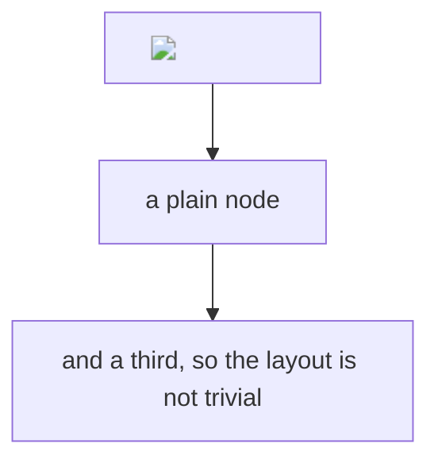
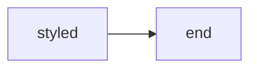

# e2e-smoke

The document `test/e2e/smoke.mjs` measures. Every construct below is here because
something about it was once wrong, or was claimed to be wrong and was not.

The probe hosts all end in `.invalid`, which is reserved by RFC 2606 and resolves
nowhere. Nothing here can reach a real server even if every guard fails — what the test
measures is whether the request is *attempted*.

## A remote image

An audit reported that `blockRemoteImages` could not block anything, because the markup
is in the live DOM before the code that clears `src` runs. Measuring said otherwise: the
`src` is nulled and no request is made. This is here so that stays true.


## A Mermaid label carrying an image

This one was real. `markdown.rs` hands a fence body over HTML-escaped, so ammonia never
sees inside it, and Mermaid's own DOMPurify allows `img`. The diagram fetched the image
twice per render.



## A stylesheet reference inside a diagram

The other way out of a diagram: `url()` in an injected `<style>`.



## Ordinary content

So the document is a document rather than a pure attack, and so a rendering regression
shows up here too.

A [real external link](https://example.com), a [relative one](./nothing.md), and an
anchor to [this heading](#ordinary-content).

| a | b |
| --- | --- |
| 1 | 2 |

> [!NOTE]
> An alert, a `code span`, and $x^2$ math.

- [ ] an unticked task
- [x] a ticked one

```rust
fn main() {
    println!("highlighted by shiki, in the webview");
}
```

<details><summary>Raw HTML that is allowed</summary>

`<details>` and <kbd>Ctrl</kbd> survive the sanitizer on purpose.

</details>
