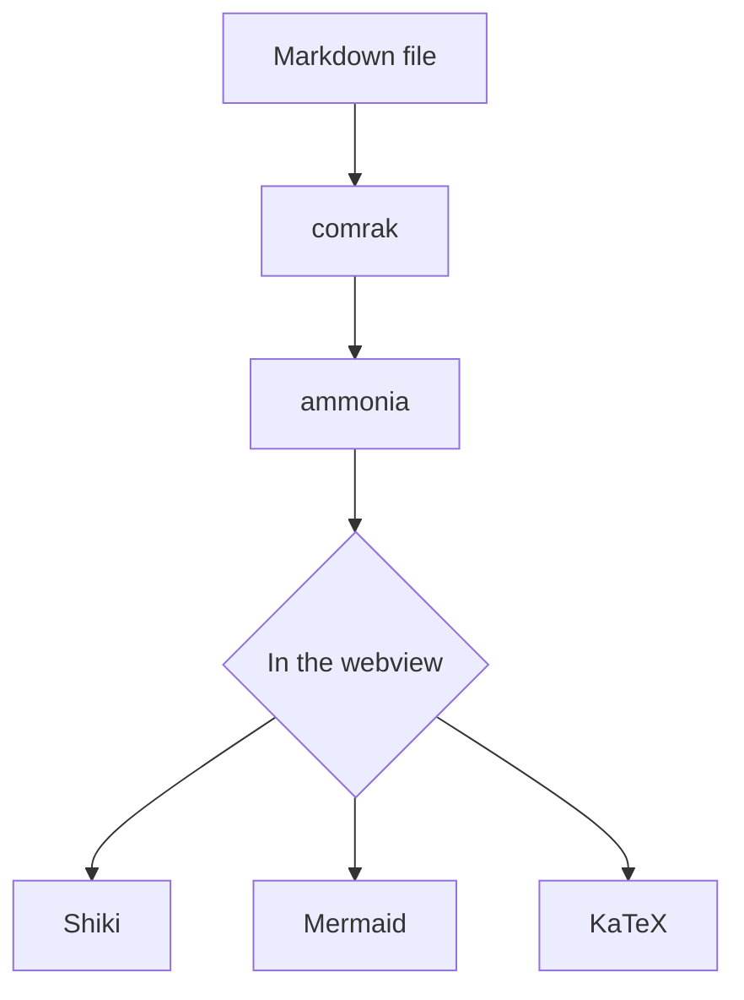
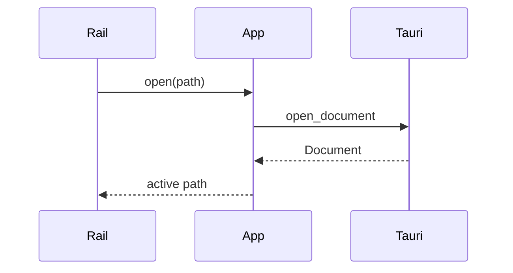
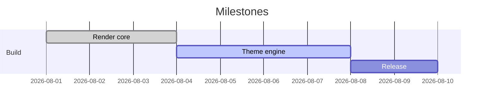

# Kitchen Sink

Every construct lindo-md claims to support, in one file. Open it beside GitHub's
rendering of the same file — that comparison is the acceptance test.

## Text

Ordinary paragraph text, long enough to show the measure doing its job and to let
you judge the line height and the colour of the ink on the page rather than
guessing from a single line.

*Emphasis*, **strong**, ***both***, ~~strikethrough~~, `inline code`, H~2~O and
E = mc^2^. A line ending in two spaces  
breaks here.

An [internal link](./nested/second.md), an [anchor link](#tables), an
[external link](https://example.com), an autolink <https://example.com>, and a
[link with a title](https://example.com "Hover me").

Link routing, which is deliberately narrower than what the app can open: these two
open in a tab — [an MDX document](./mdx-sink.mdx) and [a dialect](./nested/second.md) —
while [a text file](./plain.txt) and [a log](./sample.log) go to whatever the reader
uses for them, even though lindo-md would happily display both.

Wikilinks, which arrive with every folder of notes moved out of Obsidian and name a
file without its extension: [[nested/second]] opens that document,
[[nested/second|under another name]] does the same while reading differently, and
[[nested/second#an-anchor-to-jump-to]] lands on a heading inside it. A target that does not exist —
[[No Such Note]] — is a link like any other until it is clicked.

> A blockquote, which should read as a quotation rather than as a grey box.
>
> — with a second paragraph

## Headings

### Level three

#### Level four

##### Level five

###### Level six

## Lists

- Unordered
- With a nested list
  - Second level
    - Third level
- And a long item that wraps onto a second line so the hanging indent is visible

1. Ordered
2. Second
   1. Nested ordered
3. Third

- [x] A completed task
- [ ] An incomplete task
- [ ] A task with `code` and **emphasis** in it

Term
: The definition of that term.

Another term
: Its definition.

## Alerts

> [!NOTE]
> Useful information a reader should notice even when skimming.

> [!TIP]
> Optional advice for doing something better.

> [!IMPORTANT]
> Key information a reader needs to succeed.

> [!WARNING]
> Urgent information needing immediate attention.

> [!CAUTION]
> Advises about risks or negative outcomes.

## Tables

| Language   | Extension | Highlighted |    Lines |
| :--------- | :-------: | ----------- | -------: |
| Rust       |   `.rs`   | yes         |   12,847 |
| TypeScript |   `.ts`   | yes         |    9,102 |
| Markdown   |   `.md`   | n/a         |      431 |

## Code

Plain fence:

```
No language, so no highlighting.
```

With a language:

```rust
/// Renders markdown to sanitized HTML.
pub fn render(source: &str) -> RenderedDoc {
    let arena = Arena::new();
    let root = comrak::parse_document(&arena, source, &options());
    RenderedDoc { html: sanitize(root), ..Default::default() }
}
```

```ts title="ipc.ts"
export function openDocument(path: string): Promise<Document> {
  return call("open_document", DocumentSchema, { path });
}
```

```python
def fib(n: int) -> int:
    a, b = 0, 1
    for _ in range(n):
        a, b = b, a + b
    return a
```

```json
{ "format": "lindo-md-theme", "version": 1 }
```

```bash
pnpm install && pnpm tauri dev
```

```sql
SELECT name, count(*) FROM documents GROUP BY name ORDER BY 2 DESC;
```

```css
.doc { max-width: var(--doc-measure); }
```

```html
<details><summary>Escaped, not executed</summary></details>
```

```yaml
theme: house
appearance: system
```

```diff
- const old = true;
+ const next = false;
```

## Diagrams







A deliberately broken diagram, which must show its source rather than breaking
the page:

```mermaid
graph TD
    A --> --> B[[[
```

## Math

Inline: the identity $e^{i\pi} + 1 = 0$ sits in the run of text.

Display:

$$
\sum_{i=1}^{n} i = \frac{n(n+1)}{2}
$$

## HTML

<details>
<summary>A collapsed section</summary>

Hidden until opened, and containing **markdown** of its own.

</details>

Press <kbd>Ctrl</kbd> + <kbd>F</kbd> to search.

A <mark class="lindo-yellow">highlighted phrase</mark>, which is what an annotated
export writes a mark as — so reopening one of those lands here.

## Images

A local image, relative to this file:


A remote image, which must be blocked until the reader asks for it:


A missing local image, which must say so plainly:


## Emoji

Shortcodes render as emoji: :tada: :rocket: :warning: :books:

## Footnotes

Some claim needing a source[^source], and another[^second].

[^source]: The footnote's text, at the bottom of the document.
[^second]: A second note, to check the list renders as one section.

## Hostile input

None of the following may survive the sanitizer.

<script>alert('xss')</script>
<iframe src="https://evil.test"></iframe>
<div onclick="steal()">A div with an event handler</div>
<p style="position:fixed;top:0;left:0">Absolutely positioned over the chrome</p>

[A javascript: link](javascript:alert(1))

---

That's everything.
